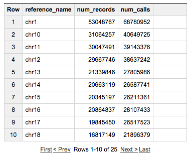

# getting-started-bigquery

The repository contains examples of using BigQuery with
genomics data. The code within each language-specific folder demonstrates the
same set of queries upon the Platinum Genomes dataset.  For more detail about
this data see [Google Genomics Public Data](https://cloud.google.com/genomics/data/platinum-genomes).

## Using the BigQuery browser tool

1. Go to the BigQuery [Browser Tool](https://bigquery.cloud.google.com/table/genomics-public-data:platinum_genomes.variants).
1. Click on **"Compose Query"**.
1. Copy and paste the following query into the dialog box and click on **"Run Query"**:
```
# Count the number of records (variant and reference segments) we have in the dataset
# and the total number of calls nested within those records.
# 
# The source data for table genomics-public-data:platinum_genomes.variants
# was gVCF so a record can be a particular variant or a non-variant segment.
# https://sites.google.com/site/gvcftools/home/about-gvcf
#
SELECT
  reference_name,
  COUNT(reference_name) AS num_records,
  COUNT(call.call_set_name) AS num_calls
FROM
  `genomics-public-data.platinum_genomes.variants` v, v.call call
GROUP BY
  reference_name
ORDER BY
  reference_name
```

View the results!



## What next?
----------
  * Work through the [Analyze variants using Google BigQuery](http://googlegenomics.readthedocs.org/en/latest/use_cases/analyze_variants/analyze_variants_with_bigquery.html) codelab.  The purpose of this codelab is to help you:
    * learn how to use the Google BigQuery query tool
    * learn valuable BigQuery SQL syntax
    * become familiar with the variants table created by a Google Genomics variant export
  * Try a few more queries in the [sql](./sql) subdirectory.
    + [variant-level-data-for-brca1.sql](./sql/variant-level-data-for-brca1.sql)
    + [sample-level-data-for-brca1.sql](./sql/sample-level-data-for-brca1.sql)
    + [sample-variant-counts-for-brca1.sql](./sql/sample-variant-counts-for-brca1.sql)
    + Replace `_THE_TABLE_` with `genomics-public-data:platinum_genomes.variants` or your own table if you have exported variants from Google Genomics to BigQuery.
  * New to BigQuery?
    + See the [query reference](https://cloud.google.com/bigquery/query-reference).
    + See the BigQuery book [Google BigQuery Analytics](http://www.wiley.com/WileyCDA/WileyTitle/productCd-1118824822.html)
  * New to working with variants?
    + See an overview of the [VCF data format](http://vcftools.sourceforge.net/VCF-poster.pdf).
  * Looking for more advanced sample queries?
    + See [BigQuery Examples](https://github.com/googlegenomics/bigquery-examples).

Alternate ways to work with BigQuery
--------------------------------------

Instead of using the browser tool to send queries to BigQuery, you can use code in many languages to call the BigQuery API.

* Try the "getting started" samples in one or more languages by navigating to the subdirectory in this repository for the desired language:
  + [RMarkdown](./RMarkdown)
  + [R](./R)
* All languages will require a Project ID from a project that has the BigQuery API enabled.
  + Follow the [BigQuery sign up instructions](https://cloud.google.com/bigquery/sign-up) if you do not yet have a valid project.  (Note: you do not need to enable billing for the small examples in this repository)
  + You can find the Project ID for your new project in the
  [Google Cloud Console](https://console.cloud.google.com).

* For more information on accessing BigQuery from other languages, see:
[Create A Simple Application With the API](https://cloud.google.com/bigquery/create-simple-app-api)
