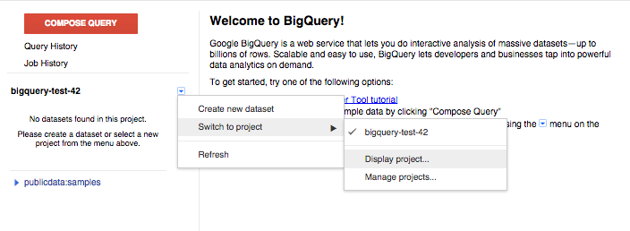
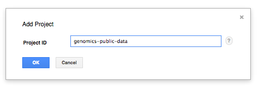

getting-started-bigquery
========================

The repository contains examples of using BigQuery with
genomics data. The code within each language-specific folder demonstrates the
same set of queries upon the Platinum Genomes dataset.  For more detail about
this data see [Google Genomics Public Data](https://cloud.google.com/genomics/data/platinum-genomes).

For more advanced examples, see [BigQuery Examples](https://github.com/googlegenomics/bigquery-examples)

All languages will require a Project ID from a project that has the BigQuery API enabled.
Follow the [BigQuery sign up instructions](https://developers.google.com/bigquery/sign-up)
if you do not yet have a valid project.
(Note: you do not need to enable billing for the small examples in this repository)

You can find the Project ID for your new project in the
[Google Developers Console](https://console.developers.google.com).


Using the BigQuery browser tool
-------------------------------

Instead of using code to call the BigQuery API, you can also use the Browser
Tool to manually execute queries.

1. Go to the BigQuery [Browser Tool](https://bigquery.cloud.google.com).
1. Click on **"Compose Query"**.
1. Copy and paste the following query into the dialog box and click on **"Run Query"**:
```
SELECT
  reference_name,
  COUNT(reference_name) AS num_records,
  COUNT(call.call_set_name) AS num_calls
FROM
  [genomics-public-data:platinum_genomes.variants]
GROUP BY
  reference_name
ORDER BY
  reference_name
```
View the results!

###Adding datasets from Google Genomics Public Data

You can also add the [Google Genomics Public Data](https://developers.google.com/genomics/public-data)
BigQuery datasets to the browser tool so that they show up in the left-hand navigation pane.

  1. Click on the drop down icon beside your project name in the left-hand navigation pane.
  1. Pick _‘Switch to project’_ in the menu, and _‘Display project...’_ in the submenu
  
  1. Enter `genomics-public-data` in the _‘Add Project’_ dialog.
  
  1. The datasets will then show up in the left-hand navigation pane.

What next?
----------
  * New to BigQuery?
    + See the [query reference](https://developers.google.com/bigquery/query-reference).
  * New to working with variants?
    + See an overview of the [VCF data format](http://vcftools.sourceforge.net/VCF-poster.pdf).
  * Looking for more sample queries?
    + See [BigQuery Examples](https://github.com/googlegenomics/bigquery-examples).
